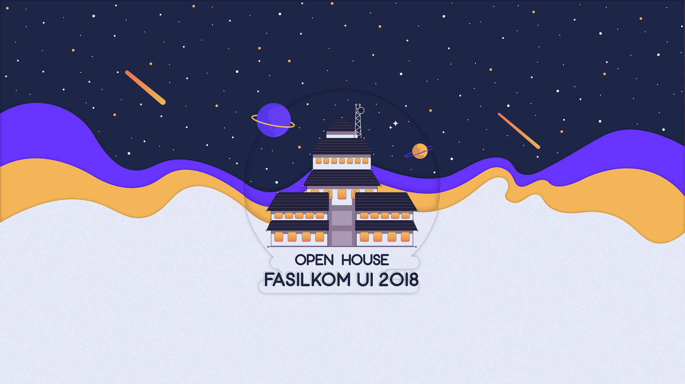

# OPEN HOUSE FASILKOM UNIVERSITAS INDONESIA

## Description
> **Open House Fasilkom 2018** is an annual event that provides information about Fakultas Ilmu Komputer in Universitas Indonesia

## Environment

##### Frameworks
##### 1. Foundation
> - version 4.0.0, [link](https://foundation.zurb.com/ "The most advanced responsive front-end framework in the world.")

##### Libraries
###### 1. Hover CSS
> - version 5.0.8, [link](http://ianlunn.github.io/Hover/ "Hover CSS Website")

## Contributors
###### Full Stack Developer
> - Muhammad Fachry Nataprawira, see [linkedin](https://www.linkedin.com/in/nataprawiraf/ "see Fachry on LinkedIn") / [github](https://github.com/ciferivalle "see Fachry on Github")

###### UI/UX Designer
> - Roshani Ayu Pranasti, see [linkedin](https://www.linkedin.com/in/roshani-ayu-pranasti/ "see Asti on LinkedIn")
